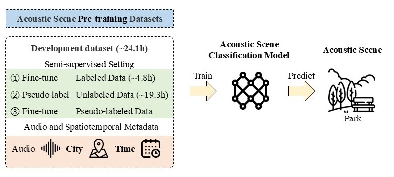

# City and Time-Aware Semi-supervised Acoustic Scene Classification

Baseline for APSIPA ASC 2025 GC.

This Challenge aims to push the boundaries of computational audition by tackling one of its most compelling problems: effectively classifying acoustic scenes under significant domain shifts.

## Challenge Website
[APSIPA ASC 2025 GC](https://www.apsipa2025.org/wp/grand-challenge/)  
[Challenge website](https://ascchallenge.xshengyun.com/)  
[Google groups](https://groups.google.com/g/apsipa2025gc)  
[Development audio recordings](https://zenodo.org/records/10616533)  
[Evaluation audio recordings](https://zenodo.org/records/10820626)  

## Updates

**2025-June-05 The challenge has started and the development dataset is available.**


## Official Baseline



### Step 1: Python Running Environment
```shell
conda create -n ASC python=3.10
conda activate ASC
git clone git@github.com:JishengBai/APSIPA2025ASC.git; cd APSIPA2025ASC
pip install -r requirement.txt
```  

### Step 2: Feature extraction
```shell
# Feature extraction of development dataset:
python3 feature_extraction.py --dataset dev
# Feature extraction of evaluation dataset:
python3 feature_extraction.py --dataset eval
```

### Step3: Train and Evaluate Model

```shell
# Model training, which includes the following three steps:
# (1) Training with limited labels; (2) Pseudo labeling; (3) Model training with pseudo labels.

python train.py

# Model testing, output predicted results of evaluation dataset.
python test.py
```


## Cite
```bibtex
@misc{bai2024description,
      title={Description on IEEE ICME 2024 Grand Challenge: Semi-supervised Acoustic Scene Classification under Domain Shift}, 
      author={Jisheng Bai and Mou Wang and Haohe Liu and Han Yin and Yafei Jia and Siwei Huang and Yutong Du and Dongzhe Zhang and Dongyuan Shi and Woon-Seng Gan and Mark D. Plumbley and Susanto Rahardja and Bin Xiang and Jianfeng Chen},
      year={2024},
      eprint={2402.02694},
      archivePrefix={arXiv},
      primaryClass={eess.AS}
}
```
```bibtex
@ARTICLE{9951400,
  author={Bai, Jisheng and Chen, Jianfeng and Wang, Mou and Ayub, Muhammad Saad and Yan, Qingli},
  journal={IEEE Transactions on Cognitive and Developmental Systems}, 
  title={A Squeeze-and-Excitation and Transformer-Based Cross-Task Model for Environmental Sound Recognition}, 
  year={2023},
  volume={15},
  number={3},
  pages={1501-1513},
  keywords={Task analysis;Acoustics;Computational modeling;Speech recognition;Transformers;Pattern recognition;Computer architecture;Attention mechanism;cross-task model;data augmentation;environmental sound recognition (ESR)},
  doi={10.1109/TCDS.2022.3222350}}
```


## Organization
- Xi'an University of Posts & Telecommunications, China
- Xi'an Lianfeng Acoustic Technologies Co., Ltd., China
- Institute of Acoustics, Chinese Academy of Sciences, China
- University of Surrey, UK
- Northwestern Polytechnical University, China
- Singapore Institute of Technology, Singapore
- Nanyang Technological University, Singapore


